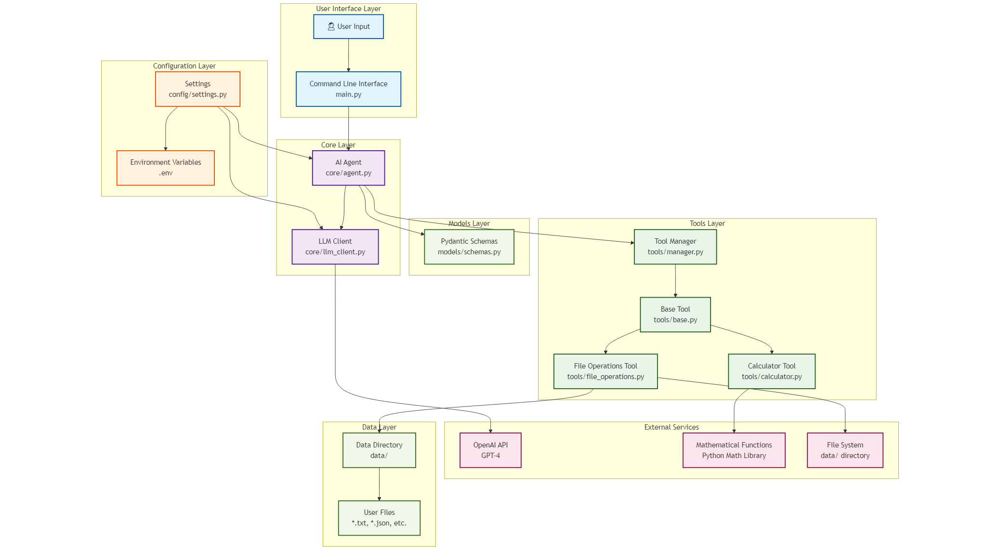
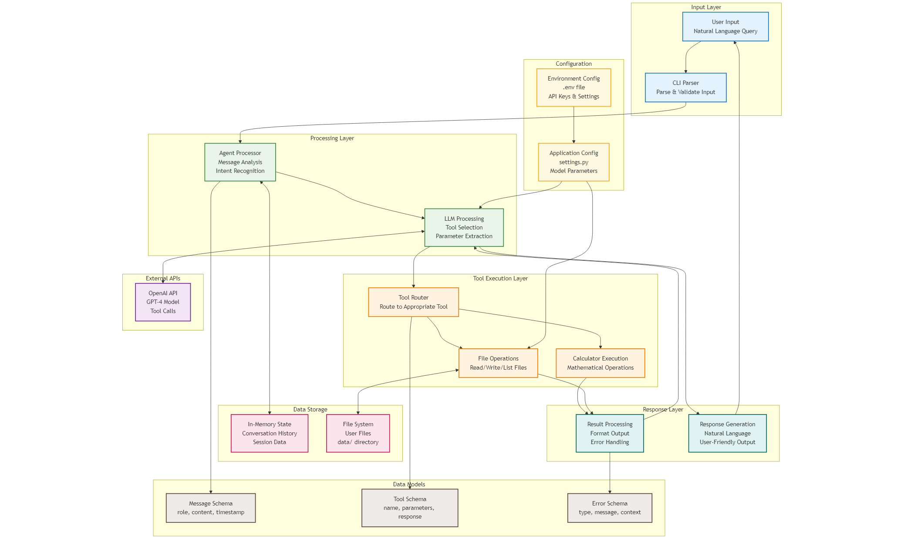

# AI Agent - LLM Based Mathematical Calculator

## Contents

1. [Overview](#overview)
2. [⚙️ Architecture](#-architecture)
3. [🚀 Features](#-features)
4. [📁 Project Structure](#-project-structure)
5. [🛠️ Installation](#-installation)
6. [🔧 Configuration](#-configuration)
7. [🛠️ Available Tools](#-available-tools)
    * [Calculator Tool](#calculator-tool)
    * [File Operations Tool](#file-operations-tool)
8. [💻 Usage Examples](#-usage-examples)
    * [Basic Interaction](#basic-interaction)
    * [Complex Calculations](#complex-calculations)
    * [File Operations](#file-operations)
9. [🏗️ Architecture](#-architecture)
10. [🧪 Testing](#-testing)
11. [🐛 Troubleshooting](#-troubleshooting)
    * [Common Issues](#common-issues)


## Overview

A modular, extensible AI Agent implementation built from scratch using Python and OpenAI's API. This project demonstrates how to create a functional AI agent with tool integration, proper error handling, and clean architecture.

<!-- TOC --><a name="-architecture"></a>
## ⚙️ Architecture





<!-- TOC --><a name="-features"></a>
## 🚀 Features

- **Modular Design**: Clean separation of concerns with dedicated modules for tools, models, and core functionality
- **Tool Integration**: Built-in support for calculator and file operations tools
- **Extensible Architecture**: Easy to add new tools and capabilities
- **Error Handling**: Robust error handling and logging
- **Type Safety**: Full type hints using Pydantic models
- **Interactive CLI**: User-friendly command-line interface

<!-- TOC --><a name="-project-structure"></a>
## 📁 Project Structure

```
ai-agent-math-calculator/
├── config/
│   └── settings.py         # Configuration and settings
├── core/
│   ├── agent.py            # Main AI Agent implementation
│   └── llm_client.py       # OpenAI API client
├── models/
│   └── schemas.py          # Pydantic data models
├── tools/
│   ├── base.py             # Base tool class
│   ├── calculator.py       # Calculator tool implementation
│   ├── file_operations.py  # File operations tool
│   └── manager.py          # Tool manager
├── data/                   # Directory for file operations
├── tests/                  # Unit and Integration Test cases
├── main.py                 # Main entry point
├── requirements.txt        # Python dependencies
├── setup.py               # Package setup
├── .env.example           # Environment variables example
└── README.md              # This file
```

<!-- TOC --><a name="-installation"></a>
## 🛠️ Installation

1. **Clone the repository**:
   ```bash
   git clone <repository-url>
   cd ai-agent-math-calculator
   ```

2. **Install dependencies**:
   ```bash
   pip install -r requirements.txt
   ```

3. **Set up environment variables**:
   ```bash
   cp .env.example .env
   # Edit .env and add your OpenAI API key
   ```

4. **Run the agent**:
   ```bash
   python main.py
   ```

<!-- TOC --><a name="-configuration"></a>
## 🔧 Configuration

Create a `.env` file in the root directory with your OpenAI API key:

```env
OPENAI_API_KEY=openai_api_key
```

Optional configurations:
- `OPENAI_MODEL`: Model to use (default: gpt-4)
- `OPENAI_TEMPERATURE`: Temperature for responses (default: 0.7)
- `OPENAI_MAX_TOKENS`: Maximum tokens per response (default: 1000)

<!-- TOC --><a name="-available-tools"></a>
## 🛠️ Available Tools

<!-- TOC --><a name="calculator-tool"></a>
### Calculator Tool
Perform mathematical calculations including:
- Basic arithmetic operations (+, -, *, /, **, %)
- Mathematical functions (sqrt, sin, cos, tan, log, exp, abs, round)

**Example usage**:
- "Calculate 25 * 4 + sqrt(16)"
- "What is 15% of 250?"
- "Solve: 2^3 + log(100)"

<!-- TOC --><a name="file-operations-tool"></a>
### File Operations Tool
Handle file operations securely:
- Read file contents
- Write content to files
- List files in the data directory

**Example usage**:
- "Write 'Hello World' to a file called greeting.txt"
- "Read the contents of greeting.txt"
- "List all files"

<!-- TOC --><a name="-usage-examples"></a>
## 💻 Usage Examples

<!-- TOC --><a name="basic-interaction"></a>
### Basic Interaction
```
👤 You: What is the square root of 144?
🤖 Agent: I'll calculate that for you.

The square root of 144 is 12.
```

<!-- TOC --><a name="complex-calculations"></a>
### Complex Calculations
```
👤 You: Calculate the area of a circle with radius 5
🤖 Agent: I'll calculate the area of a circle with radius 5.

Using the formula A = π × r², where r = 5:
A = π × 5² = π × 25 ≈ 78.54

The area of a circle with radius 5 is approximately 78.54 square units.
```

<!-- TOC --><a name="file-operations"></a>
### File Operations
```
👤 You: Create a file called "notes.txt" with a list of programming languages
🤖 Agent: I'll create a file called "notes.txt" with a list of programming languages.

Successfully wrote to notes.txt
```

<!-- TOC --><a name="-architecture"></a>
## 🏗️ Architecture

The agent follows a clean, modular architecture:

- **Core**: Contains the main agent logic and LLM client
- **Tools**: Modular tool system with base classes and implementations
- **Models**: Pydantic schemas for type safety and data validation
- **Config**: Centralized configuration management

<!-- TOC --><a name="-testing"></a>
## 🧪 Testing

Run tests 
```bash
python -m pytest tests/
```

<!-- TOC --><a name="-troubleshooting"></a>
## 🐛 Troubleshooting

<!-- TOC --><a name="common-issues"></a>
### Common Issues

1. **API Key Error**: Make sure your OpenAI API key is set in the `.env` file
2. **Import Errors**: Ensure all dependencies are installed with `pip install -r requirements.txt`
3. **File Permission Errors**: Check that the `data/` directory has proper write permissions

